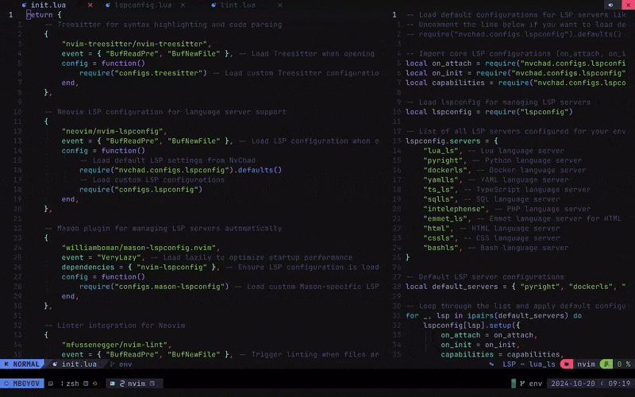

<div align="center">

[![Contributors][contributors-shield]][contributors-url]
[![Forks][forks-shield]][forks-url]
[![Stargazers][stars-shield]][stars-url]
[![Issues][issues-shield]][issues-url]
[![MIT License][license-shield]][license-url]

</div>

<!-- PROJECT LOGO -->
<br />
<div align="center">
  <a href="https://github.com/mboyov/pane-resizer.nvim">
    
  </a>
  <h3 align="center">Pane Resizer</h3>
  <p align="center">
    A Neovim plugin to dynamically resize panes, focusing on the active window and excluding NvimTree and floating windows.
  </p>
</div>

---

Pane Resizer is a Neovim plugin that automates pane resizing to optimize workspace layouts. With Pane Resizer, you can keep specific windows like `NvimTree` at a fixed width, distribute space evenly among inactive panes, and configure custom resizing for the focused pane.

## Features

- **Automatic Pane Resizing**: Automatically resizes the focused pane to a user-defined percentage.
- **NvimTree Handling**: Keeps `NvimTree` at a fixed width, even when switching focus.
- **Floating Windows Exclusion**: Ignores floating windows during pane resizing.

## Why use this?

- **Efficiency**: Dynamically resize panes to enhance workflow by focusing on essential windows.
- **Customization**: Offers flexible settings for the size of focused windows, `NvimTree`, and other panes.
- **Compatibility**: Designed to work seamlessly with floating windows. 

## Installation & Configuration

### 1. Installation

Using your preferred plugin manager:

```lua
-- Using LazyVim
return {
  {
    "mboyov/pane-resizer.nvim",
    config = function()
      require('pane_resizer').setup({
        NVIMTREE_WIDTH = 40,              -- Set NvimTree width (default is 30)
        FOCUSED_WIDTH_PERCENTAGE = 0.5,   -- Resize focused window to 50% (default is 60%)
      })
    end,
  },
}
```

### 2. **Use Cases**:

- Users who work with multiple splits and need a focused window to occupy a larger portion of the screen.
- Users who want to keep NvimTree at a fixed width.
- Users who use floating windows and want them excluded from the resizing logic. 

## Contributing
Feel free to open issues or pull requests if you have suggestions for improvements.

## License
Distributed under the MIT License. See LICENSE for more information.

## Credits
- [Neovim ](https://neovim.io) for creating an extensible editor that makes plugins like this possible.
- Thanks to the Neovim community for their valuable resources and examples.

[contributors-shield]: https://img.shields.io/github/contributors/mboyov/pane-resizer.nvim.svg?style=for-the-badge
[contributors-url]: https://github.com/mboyov/pane-resizer.nvim/graphs/contributors
[forks-shield]: https://img.shields.io/github/forks/mboyov/pane-resizer.nvim.svg?style=for-the-badge
[forks-url]: https://github.com/mboyov/pane-resizer.nvim/network/members
[stars-shield]: https://img.shields.io/github/stars/mboyov/pane-resizer.nvim.svg?style=for-the-badge
[stars-url]: https://github.com/mboyov/pane-resizer.nvim/stargazers
[issues-shield]: https://img.shields.io/github/issues/mboyov/pane-resizer.nvim.svg?style=for-the-badge
[issues-url]: https://github.com/mboyov/pane-resizer.nvim/issues
[license-shield]: https://img.shields.io/github/license/mboyov/pane-resizer.nvim.svg?style=for-the-badge
[license-url]: https://github.com/mboyov/pane-resizer.nvim/blob/main/LICENSE.txt
